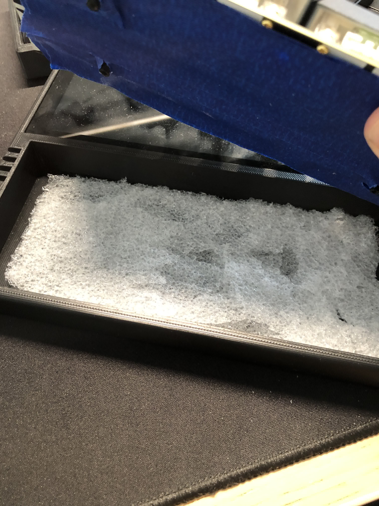

  

<h1 align="center">QAZ Cyberdeck</h1>
<h3 align="center">A compact cyberdeck, featuring a QAZ 35% keyboard, Banana Pi M2 Zero SBC and 7.9 inch monitor.</h3>

  
  
  

## Contents
- [Introduction](#introduction)
- [Parts](#parts)
  - [Hardware](#hardware)
  - [Keyboard](#keyboard)
  - [Cables](#cables)
  - [Tools](#tools)
  - [Files](#files)
- [Design Decisions](#design-decisions)
- [Building](#building)
  - [Keyboard](#keyboard)
  - [Cables](#cables)
  - [HDMI Cable](#hdmi-cable)
  - [Flashing Linux](#flashing-linux)
  - [Test Build](#test-build)
  - [Wrap up](#wrap-up)
- [Ricing](#ricing)
- [Conclusion](#conclusion)

## Introduction
First of all, I'd love to thank whydobearsxplod for creating the QAZ keyboard (along with [tominabox1](https://github.com/tominabox1)) and the cyberdeck itself. The credit for this build fully goes out to him. [The original post can be found here](https://hackaday.io/project/187525-qaz-personal-terminal), which is also entirely what I used, along with a few tips from the creator, to build the deck.

The purpose of this post is to document the building process to help anyone interested in making this, or simply enjoying the adventure. This is not a fully comprehensive guide on how to make everything from scratch (e.g. soldering the keyboard), but I will provide all the necessary resources to learn the missing parts throughout the read.

Lastly, I had close to zero prior knowledge in making any of this, apart from soldering two keyboards and using Linux for a year. If you want to make this but feel intimidated, I was in your same spot. You just need to take your time and read before you do anything permanent. *If I made this, so can you.*

With that said, enjoy the read!

## Parts

    
    
    
    
    

### Hardware
- [Banana Pi M2 Zero](https://it.aliexpress.com/item/32862713418.html?spm=a2g0o.order_list.order_list_main.41.474c36968LM9De&gatewayAdapt=glo2ita)
- [Banana Pi Cooler](https://it.aliexpress.com/item/1005004448358506.html?spm=a2g0o.order_list.order_list_main.31.474c36968LM9De&gatewayAdapt=glo2ita)
- [Ampripper 3000](https://www.kickstart-design.com/our-products/p/amp-ripper-3000)
- [Waveshare 7.9 LCD Monitor](https://www.waveshare.com/7.9inch-hdmi-lcd.htm)
- [3D printed case](https://xometry.eu/en/) - I used this website to get the case files printed, but I live in Europe, so Google whichever service works best in your region.
- Fast Micro SD Card - This is the only thing I will not link from Aliexpress, for two reasons: 1. they're everywhere and fairly inexpensive. 2. I bought a cheap one at first, and it heavily bottlenecked my system, so don't skimp out on it. a 128gb one cost me only $15.
- [Wi-Fi Antenna](https://it.aliexpress.com/item/4001057394662.html?spm=a2g0o.order_list.order_list_main.4.474c36968LM9De&gatewayAdapt=glo2ita) - Optional, but will make the Wi-Fi in the BananaPi stronger.
- [Battery](https://www.ebay.it/itm/112255938273) - Note: if you don't buy this one, make sure it measures L 47mm - W 55mm - H 10mm. The battery can be slightly larger and longer, but not thicker than 10mm.

### Keyboard
- [QAZ PCB](https://www.cbkbd.com/product/qaz) - if you decide to buy the Integrated version, you won't need to buy a Pro Micro.
- [Pro Micro](https://it.aliexpress.com/item/1576902211.html?spm=a2g0o.order_list.order_list_main.51.474c36968LM9De&gatewayAdapt=glo2ita)
- [Kailh Box Jades (x70)](https://it.aliexpress.com/item/1005003957173643.html?spm=a2g0o.productlist.main.1.62fc7694K5LimM&algo_pvid=f210ab8b-75b8-4add-a1fa-33b13a1de756&algo_exp_id=f210ab8b-75b8-4add-a1fa-33b13a1de756-0&pdp_npi=3%40dis%21EUR%2139.22%2129.81%21%21%21%21%21%402102169316839035771892066d075a%2112000027564907385%21sea%21IT%212000347138&curPageLogUid=IPZKu3ONIe5O)
- [Keycaps](https://it.aliexpress.com/item/1005003276178498.html?spm=a2g0o.order_list.order_list_main.56.474c36968LM9De&gatewayAdapt=glo2ita)
- [Stabilizers](https://it.aliexpress.com/item/4000268680880.html?spm=a2g0o.order_list.order_list_main.15.474c36968LM9De&gatewayAdapt=glo2ita) - Optional, but recommended.

### Cables
- [Micro USB headers](https://it.aliexpress.com/item/32874847823.html?spm=a2g0o.order_list.order_list_main.46.474c36968LM9De&gatewayAdapt=glo2ita)
- [USB C Headers](https://it.aliexpress.com/item/1005005234547018.html?spm=a2g0o.productlist.main.1.5c1cM99YM99YSN&algo_pvid=af9bc535-6dca-4fbc-a23a-6272142d0899&algo_exp_id=af9bc535-6dca-4fbc-a23a-6272142d0899-0&pdp_npi=3%40dis%21EUR%213.38%212.2%21%21%21%21%21%402102111816839038454514008d07ee%2112000032306536100%21sea%21IT%212000347138&curPageLogUid=bXu38OBH51CE)
- [Custom HDMI Cable](https://it.aliexpress.com/item/4000014554460.html?gps-id=pcStoreLeaderboard&scm=1007.22922.271278.0&scm_id=1007.22922.271278.0&scm-url=1007.22922.271278.0&pvid=0108b827-8853-4e6f-8445-d08d1945c893&_t=gps-id%3ApcStoreLeaderboard%2Cscm-url%3A1007.22922.271278.0%2Cpvid%3A0108b827-8853-4e6f-8445-d08d1945c893%2Ctpp_buckets%3A668%232846%238110%231995&pdp_npi=3%40dis%21EUR%210.8%210.75%21%21%21%21%21%40213db7b316839049659704541e2c4f%2112000021640768890%21rec%21IT%212000347138&spm=a2g0o.store_pc_home.smartLeaderboard_6000808235239.4000014554460&gatewayAdapt=glo2ita) - Add to cart : C1 connector, A5 connector, Only FFC -5cm.
- [Electrical Wire](https://it.aliexpress.com/item/1005004674373201.html?spm=a2g0o.productlist.main.7.74673372vYUbVW&algo_pvid=cd47641c-a387-430c-8be8-e357f6a89046&algo_exp_id=cd47641c-a387-430c-8be8-e357f6a89046-3&pdp_npi=3%40dis%21EUR%2124.69%2116.79%21%21%21%21%21%40211be59e16839045291834101d0858%2112000030059612042%21sea%21IT%212000347138&curPageLogUid=NpEaCH9AqEdd) - Make sure it's 28awg thickness. This is way more than you need, but it gives you freedom to get cables wrong without worrying about running out of wire.

### Tools
- M2 / M2.5 screws
- Soldering station - Even a super cheap one is fine, I paid mine around $20.
- [Screwdriver and tools kit](https://eustore.ifixit.com/products/pro-tech-toolkit) - not necessarily this one, but having these tools helped a lot.
- Solder flux - Not strictly necessary, but it was really handy when soldering.

### Files
- [Case](/Case.stl)
- [Back Panel](/Back.stl)

You can either 3D print these at home, if you have a printer, or have them printed by a company and shipped like I did.  

The overall price came out to, more or less, $300. This will vary depending on whether your local Amazon/Ebay purchases differ from mine.

## Design Decisions

 

    
  

I didn't deviate too much from the original project, however, the few customizations I made were intentional. I wanted to go for a more "retro" feel, so I landed upon a clone of the GMK Pixel keycaps. The UI is also mainly terminal based, both for stylistic and hardware requirements reasons. Basing the entire UX around a highly stylized terminal both sells the feeling of this being an old device, and also saves up on the already scarce computing power. 

Using blank keycaps, mixed with the already challenging nature of using a 35% keyboard and the terminal UI, gives the deck a distinct "mistique" feeling to it, as if it belongs to a sci-fi movie from the 80s, where the device looks so absurdly complicated and foreign, that the viewer unmistakably feels it could only exists in a far future. 

## Building

### Keyboard

  

    
    
  

  
For the keyboard switches, I decided to go for Kailh Box Jades, which are clicky switches. I've always wanted to try good clickies but always thought that building an entire keyboard around them was overkill. The cyberdeck was the perfect opportunity to get them, since I won't be using it extensively.

- [Official QAZ Docs](https://docs.cbkbd.com/build-guides/qaz.html)
- [QAZ Build Video](https://www.youtube.com/watch?v=PCCtk3ZYISA&t=6687s&pp=ygUKcWF6IGJ1aWxkIA%3D%3D)
- [Switches Soldering Guide](https://www.youtube.com/watch?v=cRJV1jo5vao&pp=ygUjaG93IHRvIHNvbGRlciBhIG1lY2hhbmljYWwga2V5Ym9hcmQ%3D)
- [Stabilizers Modding Guide](https://www.youtube.com/watch?v=cD5Zj-ZgMLA&t=295s&pp=ygUXaG93IHRvIG1vZCBzdGFiaWxpemVycyA%3D) - Optional

#### Flashing Firmware
Before doing any soldering, you're first going to make sure your Pro Micro works properly. I've included a [firmware file](/tominabox1_qaz_vial.hex), which works specifically for [Vial](), more on that later. Here's the steps required to flash the firmware onto your Pro Micro (assuming you bought the one I selected):
- Open up [QMK Toolbox](https://github.com/qmk/qmk_toolbox)
- Toggle "Auto flashing"
- Select the firmware file you downloaded
- Plug in the Pro Micro
- With a pair of tweezers, short the RST and GND pins twice, quickly (picture below).
- Wait for the console to confirm the firmware has been flashed. The Pro Micro should disconnect automatically.
- Test by opening up Vial and seeing if the keyboard is recognized.

  
 

 
#### Warnings

I will not list how to build the rest of the QAZ here, however I will specify again two dangerous pitfalls, both of which I fell into:
1. :warning: **Diodes are directional, be careful of the direction you solder them in** :warning:
2. :warning: **Do not solder the Pro Micro before soldering the two switches underneath** :warning:

As a cautionary tale, I will show you what happens when you try to improvise on anything involving soldering:  

  
  
 

 
In this situation I soldered the Pro Micro before soldering the two switches underneath, which led to a *very* lenghty process of dremeling the Pro Micro away, and then painstakingly desolder each pin.   

I cannot stress this enough: **follow the build guide very carefully**. If there's one thing I learnt from soldering, is that it's very much like carpentry. Whereas in carpentry you have "Measure twice, cut once", I made up the "Read twice, solder once" rule for soldering.

#### Switches alignment
As you may have noticed, the switches are 3-pin and my build does not include an aluminum plate to clip them on before soldering. This makes soldering them a bit more complicated than usual. You can 3D print a switch aligner, like shown in the build video I linked, or (what I personally did):
- roughly align the switch
- solder the first pin
- align the switch to make it straight
- solder the second switch

Unfortunately this doesn't yield a perfectly aligned keyboard. If you prefer, you can find files to 3D print a plate for the QAZ.

#### Optional mods

  

Lastly, I tape modded the board to help with sound dampening coming from the *unfathomably loud* switches. I also added foam on the bottom of the case.

  

#### Loading the layout on the keyboard
By default, the QAZ will have a functioning key layout, but not a really complete one. I've included the [layout file](/qaz_layout.vil) I made and use daily on mine, but once loaded in Vial you can modify it to your needs. 
- Open Vial
- Select File > Load Saved Layout
- Select the layout file you downloaded

### Cables  

[Cable Soldering Guide](https://www.youtube.com/watch?v=yyUydcPD7cQ&t=398s&pp=ygUVY2FibGUgc29sZGVyaW5nIGd1aWRl)

You're gonna need to make four cables:
- A power only USB-C to Micro USB, to connect the Ampripper to the Banana Pi.
- A OTG Micro USB to Micro USB (or Micro USB to USB-C if bought the Integrated version of the QAZ PCB), to connect the Banana Pi and keyboard.
- A Micro USB to bare wires, to power the monitor.
- A simple extension to make the battery's cables reach the Ampripper.

For each cable, I recommend wrapping the joints with electrical tape to give some structural integrity.

#### USB-C / Micro USB Power Only

  
 

 
 | Pin | Name | Wire color | Description                |
| --- | ---- | ---------- | -------------------------- |
| 1   | VBUS | Red        | +5 V                       |
| 2   | D−   | White      | Data−                      |
| 3   | D+   | Green      | Data+                      |
| 4   | ID   | Any        | Permits detection of cable end: "A" (host) signal ground, "B" (device) not connected |
| 5   | GND  | Black      | Signal ground              |  Pin 	Name 	Wire color 	Description  

[Source](https://www.neverstopbuilding.com/blog/wiring-micro-usb-pinout)

If you've never done this, like me, I recommend starting from this one to get the basics down. Starting from the Micro USB and following the picture above, you're just gonna need to solder GND and 5V. As for the USB-C, the pins *should* be named. The linked YouTube video explains everything you need to know and gives pretty good advice. This is the end result:

  
 

 
 #### Micro USB / Ampripper
 
 This one is more or less the same. Repeat what you did for the first cable for the Micro USB part and solder the other ends on the Ampripper, on the GND and 5V pins respectively (picture for reference). 
 
 

  
 

 
 #### Battery / Ampripper
 
 

  
 

 
 Extend the two wires of the battery and solder the 5V and ground wires to the BAT(+) and GND(-) of the Amprippper (see picture above).
 
 #### OTG Cable (Micro USB / Micro USB)
 
 I saved the best for last. For this one, you're gonna need to make a Micro USB to Micro USB cable that also includes data (D+ and D-) and an ID. This cable needs to have the ID pin soldered to the ground pin on the same side. Refer to the pictures for info. I'm not sure the way I soldered it is the most optimal, but it works. Since all pins are occupied on this one, you're gonna want to be extra careful to apply just enough solder to make the wire stick and nothing more. You definitely don't want any solder spilling to the nearby pins and short out. Make sure to wrap this cable in tape really well. (Someone on Discord also told me to use hot glue to isolate the joints but I didn't try it, might be worth a shot if you feel like it)
 
 

  
  
 

 
 #### Summary
 
 In the end, your cables should look something like this:
 
 

  
 

### HDMI Cable

  
 

The cable is straightforward to assemble, you just need to slide the flat cable on the housings and close them up. However, I made a really dumb mistake that took me like an hour to find and solve, so I'll spare you the pain: **check the cable's direction**. The blue strip should point down at the board, and the cable's pins should point upwards, relative to the connector.

:warning: The cable in the picture is in the wrong direction, do the opposite of what you see. :warning:

### Flashing Linux

[Armbian flashing guide](https://www.google.com/url?sa=t&rct=j&q=&esrc=s&source=web&cd=&cad=rja&uact=8&ved=2ahUKEwjC-5vF0vL-AhUx_rsIHfqaBHoQtwJ6BAgLEAI&url=https%3A%2F%2Fwww.youtube.com%2Fwatch%3Fv%3DA4PflbMusSQ&usg=AOvVaw2OebPqaZxCmljXgVNMQgav)

For now you're just gonna flash the [Armbian image](https://drive.google.com/file/d/11crpUOyLDn49eP76bszXfJiF2D7c0L-8/view?usp=share_link) to have an ouput on the screen. In case you don't want to use Armbian, the [official Banana Pi page](https://wiki.banana-pi.org/Banana_Pi_BPI-M2_ZERO) has a few others distros to choose from.

### Test Build

Here's a schematic of how everything should be plugged together.  

:warning: The Micro USB plugs on the Banana Pi are to be plugged as shown. The leftmost one is power only. If you swap the power and keyboard positions it will not work. :warning:  
:warning: The OTG cable that goes from the Pi to the keyboard must have the host end of the cable (the part where you soldered the extra ID pin) connected to the Banana Pi side. :warning:

  
  
 

 
- Press the on/off button at the back of the screen.
- Take the cooling kit for the Banana Pi, the cooling pad for the CPU, the thinnest of the two metal coolers and install them.
- Press the on/off button at the back of the Waveshare screen 
- Plug the Ampripper's USB-C plug in a charger, since the battery will probably be out.

If everything is plugged in correctly and all cables were soldered correctly these things should happen:
- An orange light will turn on on the Ampripper.
- A green light will turn on behind the screen.
- The Banana Pi should turn on and the Linux kernel should load.
 
 ### Wrap up
 
 Once you ensured everything is working correctly, it's finally time to put everything in the case. There's a couple of things to keep in mind:
 - Don't tighten the screen's screws too tight, as it will cause the screen to be pushed out of the case.
 - Make sure to let the keyboard's cable go underneath the Ampripper, as I broke mine when I didn't.
 

  
 

 
Caveat: even though there's a notch to make room for the HDMI cable, there seems to not be enough space since the underneath Micro USB cable pushes upwards a bit. Either manage to make a smaller cable than mine or dremel a bit of the internal case away.

## Ricing

In case you're interested in the ricing I made, I'm using:
- zsh + powerlevel10k
- bspwm
- polybar + hack theme from polybar-themes
- neovim
- pywal
- st

If interest is high enough, I'll consider expanding this section.

## Conclusion

That's it! Either if you've built this and reached this point, or just read the entire thing for fun, thanks for reading! I hope you enjoyed the read and if you have any contribution you want to make, like correcting a mistake I probably did, or even expand/fix some paragraphs, make sure to open up an [Issue or PR](https://github.com/g1sbi/qaz-cyberdeck/issues).

## Author

👤 **Gisbi**

* Twitter: [@0xgisbi](https://twitter.com/0xgisbi)
* Github: [@g1sbi](https://github.com/g1sbi)

### Creators

👤 **whydobearsxplod**   
👤 **tominabox1** - Github: [@tominabox1](https://github.com/tominabox1)
